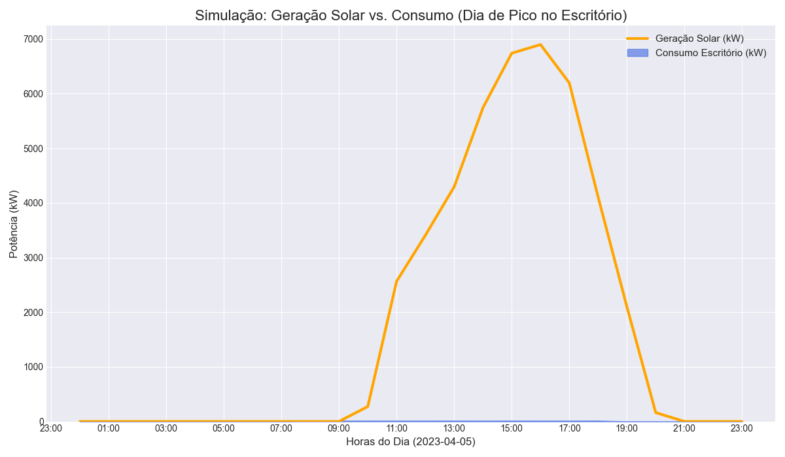

#  Global Solution 2025: Otimização Solar para o Escritório Híbrido

A solução analisa o impacto da instalação de painéis solares em um escritório com modelo de trabalho híbrido, demonstrando os ganhos econômicos e ambientais através da simulação e análise de dados.

###  Resultado Final

O script gera o gráfico abaixo, que comprova a tese do projeto: **o pico de geração de energia solar (laranja) se alinha perfeitamente com o pico de consumo do escritório (azul) nos dias de trabalho presencial.**



---

## Descrição da Proposta de solução

Este projeto cumpre os requisitos **Opção A (Análise de Dados)** e **Opção C (Simulação)**.

A solução é um único script Python (`Gs sers principal.py`) que executa todo o processo:

1.  **Simulação de Consumo:** O script primeiro gera internamente os dados de consumo de energia de um escritório para o ano de **2023**. Ele simula um padrão de "trabalho híbrido":
    * **Segundas e Sextas (Home Office):** Consumo baixo.
    * **Terças, Quartas e Quintas (Dias Presenciais):** Picos de consumo (ar-condicionado, luzes, etc.).
2.  **Análise de Geração:** O script carrega os dados reais de geração solar para **2023** (do arquivo `dados/geracao_solar_pvgis.csv`).
3.  **Cálculo e Análise:** Ele une os dados de consumo e geração (ambos de 2023) e calcula:
    * A economia financeira (R$)
    * A redução de emissão de CO2 (kg)
    * O gráfico final `resultado_dia_pico.png`.

---

##  Dados Utilizados

* **Geração Solar (Fonte Real):** O arquivo `dados/geracao_solar_pvgis.csv` contém os dados de geração de um sistema de 10kWp em São Paulo, baixados da ferramenta [PVGIS da União Europeia](https://re.jrc.ec.europa.eu/pvg_tools/en/).
* **Consumo (Fonte Simulada):** Os dados de consumo do escritório são gerados diretamente pelo script `Gs sers principal.py` para garantir que os anos correspondam.

---

##  Orientações de Execução

1.  **Clone o repositório:**
    ```bash
    git clone [https://github.com/Biasi06/Global-Solution-Energia.git](https://github.com/Biasi06/Global-Solution-Energia.git)
    cd Global-Solution-Energia
    ```

2.  **Instale as dependências:**
    (É recomendado criar um ambiente virtual: `python -m venv venv`)
    ```bash
    pip install -r requirements.txt
    ```

3.  **Execute o script:**
    ```bash
    python "Gs sers principal.py"
    ```

4.  **Verifique os resultados:**
    * O terminal mostrará o relatório completo da análise (economia, CO2 evitado, etc.).
    * O arquivo `resultado_dia_pico.png` será criado (ou atualizado) na pasta.
